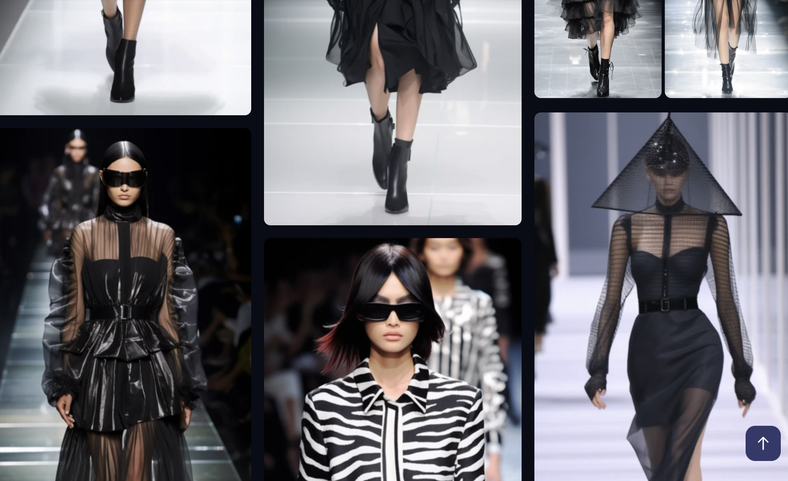

# 🌟 High Fashion Fintech: KryptoJobs2Go! 🌟

Welcome to the world of High Fashion Fintech, where the runway meets the blockchain! KryptoJobs2Go is our latest innovation, a platform that seamlessly integrates the glamour of the fashion industry with the cutting-edge technology of cryptocurrency. 

## 🎩 What is KryptoJobs2Go?

KryptoJobs2Go is a revolutionary platform that allows you to hire top-notch fintech professionals using Ethereum. It's as stylish as a Paris runway show, and as technologically advanced as a Silicon Valley startup. 

## 👠 How does it work?

Our platform is powered by a Python script that creates a digital wallet and Ethereum account from a mnemonic seed phrase. This wallet is used to manage transactions on the Ethereum blockchain. 

The script also includes functions to:

- Generate an account 🧾
- Get the balance of an account 💰
- Send transactions between accounts 💸

## 🎭 Who are the stars of our show?

Our platform features a database of high-fashion fintech models, each with their own Ethereum address, rating, and hourly cost in Ether. These models are the best in the business, and they're ready to strut their stuff on the blockchain runway.

Our current lineup includes:

- Aurora Stardust, the celestial visionary 🌟
- Seraphina Noir, the elegant enigma 🖤
- Luna Obsidian, the moonlit maven 🌙
- Electra Diamante, the sparkling sensation 💎

## 🎬 How to use KryptoJobs2Go?

Using KryptoJobs2Go is as simple as attending a fashion show. The Streamlit application provides a user-friendly interface where you can:

- View the models' profiles 📸
- Select a model to hire 👥
- Specify the number of hours worked ⏰
- Send the transaction to pay your model in Ether 💵

Once the transaction is validated, you'll receive a transaction hash for your records. And to top it all off, you'll be showered with virtual balloons to celebrate your successful payment! 🎈

## 🌐 Join the High Fashion Fintech Revolution!

KryptoJobs2Go is more than just a platform - it's a statement. It's about embracing the future of technology without compromising on style. It's about making blockchain as glamorous as a high fashion runway.

So put on your best outfit, step onto the blockchain runway, and join the High Fashion Fintech revolution with KryptoJobs2Go! 🚀🌟
